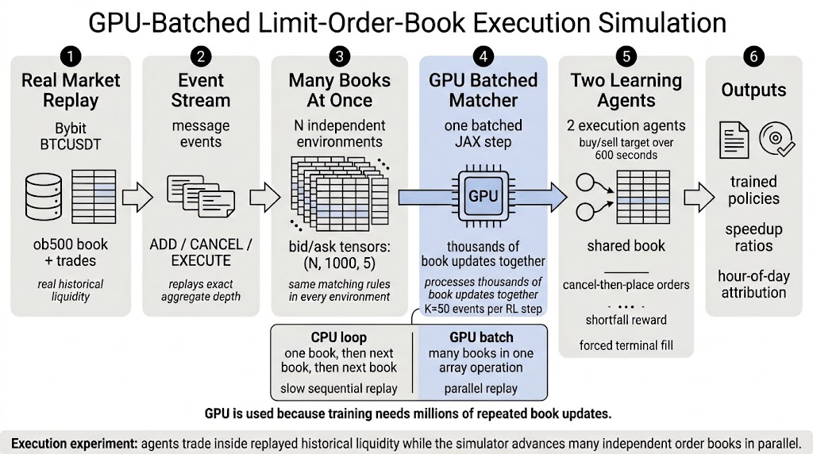

# GPU Limit-Order-Book Execution Simulation

This project constructs a GPU-batched limit-order-book execution laboratory from Bybit `BTCUSDT` linear perpetual depth and trade archives. Raw `ob500` order-book snapshots, deltas, and trade prints are converted into discrete add, cancel, and execution events under a fixed FIFO queue approximation constrained by exact aggregate-depth replay. The reconstructed stream becomes a deterministic market substrate for optimal-execution agents acting inside the same shared book as historical liquidity.

The book state uses fixed-size bid and ask arrays with `1000` rows per side and five fields per resting order: price, quantity, order id, trader id, and timestamp. This representation removes dynamic queue structures from the training path and exposes the entire simulator as batched JAX arrays. Each training step holds `N` independent environments in one leading batch dimension, applies agent order flow and historical replay through the same matching semantics, and returns fixed-length observations and normalized implementation-shortfall rewards.

The learning task assigns each agent a buy or sell target over a 600-second replay window. Two independent PPO agents operate concurrently in every environment with distinct trader ids, no coordination channel, cancel-then-place order convention, continuous price-offset and quantity actions, and forced terminal completion of any unexecuted target. Agent orders interact directly with historical liquidity and with the other agent’s resting orders through price-time priority.

The empirical path is staged. Tier 1 validates reconstruction, replay, observation, and reward plumbing. Tier 2 runs a short two-agent GPU JAX training pass over the first 30 locked dates and records three required checks: measured batched-GPU versus sequential-CPU speed ratios, at least one matured informed-flow proxy firing, and movement of both agents’ action distributions away from initialization. Tier 3 extends the same locked configuration to the full 2024 calendar year, gated by Tier 1, Tier 2, and Step 3 reports.

The final outputs are reconstructed event files, replay-validation reports, speed measurements, trained policy checkpoints, evaluation logs, and UTC hour-of-day performance attribution. Runtime commands and Vast execution details are specified in `runbook.md`.
